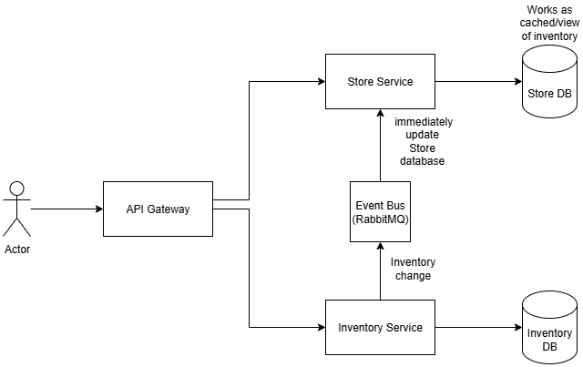

# Backend Challenge - Mercado Livre

## Microservices Design

YouTube link explaining the architecture and applications: https://www.youtube.com/watch?v=20LGYqxUxxA

### 1. API Gateway Service (Port: 8080)

**Purpose**: Single entry point for all client requests

**Responsibilities**:
* Request routing to appropriate microservices
* Authentication and authorization
* Rate limiting and request throttling
* Circuit breaker implementation

### 2. Inventory Service (Port: 8081)

**Purpose**: Core inventory management and consistency control

**Responsibilities**:
* Stock level updates and reservations
* Inventory consistency enforcement
* Real-time stock availability queries
* Distributed lock management for critical operations

### 3. Store Service (Port: 8082)

**Purpose**: Manages store information and local store operations

**Responsibilities**:
* Store registration and metadata management
* Store-specific configuration
* Local store inventory views (cached/replicated data)

## Technologies Used

* Java 21 + Spring Boot 3.5: provides rapid setup and production-ready defaults for REST APIs.
* Spring Cloud: Service discovery, configuration management, circuit breakers
* Lombok: reduces boilerplate in entity/model classes.
* Maven 3.9: industry-standard build and dependency management tool.
* OpenAPI (Swagger UI): exposes interactive API documentation with minimal configuration.
* RabbitMQ: robust message broker for asynchronous communication, ok for this prototype. But for production, Kafka would be better.
* Docker: containerization for consistent deployment environments.
* H2 Database: in-memory database for simplicity in this prototype. For production, PostgreSQL or MySQL would be better.
* Generative AI (Claude): assisted in documentation, design patterns, best practices, and code snippets.
* Github Copilot: assisted in code generation and boilerplate reduction.

## Api Design Patterns

* Circuit Breaker Pattern: Implemented using Spring Cloud Circuit Breaker with Resilience4j to handle service failures gracefully.
* Concurrency Control and Consistency: Used optimistic locking with versioning in the Inventory Service to prevent race conditions when multiple orders attempt to reserve the same product simultaneously.
* Versioning: API versioning through URL path (e.g., /v1/resource) to manage changes without breaking existing clients.
* Graceful Error Handling: Centralized exception handling using @ControllerAdvice to provide consistent error responses.

## Main Endpoints

### Inventory Service

Get inventory by product and store:

`curl --location 'http://localhost:8080/inventory-service/v1/inventories?productId=1&storeId=1'`

Reserve inventory:

`curl --location 'http://localhost:8080/inventory-service/v1/reservations' \
--header 'Content-Type: application/json' \
--data '{
    "productId": 1,
    "storeId": 1,
    "quantity": 10,
    "customerId": "1",
    "orderId": "1"
}'`

Confirm reservation:

`curl --location --request POST 'http://localhost:8080/inventory-service/v1/reservations/1/confirm'`

Cancel reservation:

`curl --location --request DELETE 'http://localhost:8080/inventory-service/v1/reservations/3'`

### Store Service

Get all stores:

`curl --location 'http://localhost:8080/store-service/v1/stores'`

Get store inventory by product and store:

`curl --location 'http://localhost:8080/store-service/v1/stores/inventories?productId=1&storeId=1'`

## Next Steps

* Implement proper authentication and authorization (e.g., OAuth2, JWT).
* Add unit and integration tests.
* Redis caching for frequently accessed data.
* Implement monitoring and logging (e.g., ELK stack, Prometheus, Grafana).
* Clustered deployment for scalability and resilience.
* CI/CD pipeline setup for automated testing and deployment.
* Use of uuid for entity IDs instead of Long for better uniqueness across distributed systems.